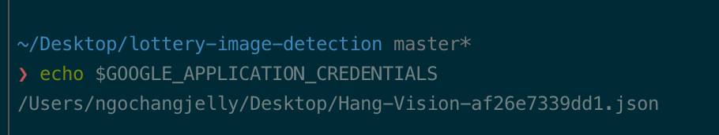

# lottery-image-detection

This peoject uses Google Cloud Vision to extract text from the lottery image and uses Nodejs as a server to communicate with fromend

## Requirements

For development, you will only need Node.js and a node global package, Yarn, installed in your environement.

### Projet setup

## Google Cloud Vision set up

- Explore what is Google Cloud Vision and how to setup an app here: https://cloud.google.com/vision/docs/drag-and-drop

- After the registration, Google would give you a creadentials. You have to download it as a JSON file.

- Set up Google Cloud Vision creadentials locally by declaring where you save your creadentials file.

```
export GOOGLE_APPLICATION_CREDENTIALS=~/Desktop/your-google-auth-key.json
```

- To check whether you have declared it successfully, you can run this command:
  

## Install packages and dependencies

- npm install

## Get the server up and running

- nodemon index.js
